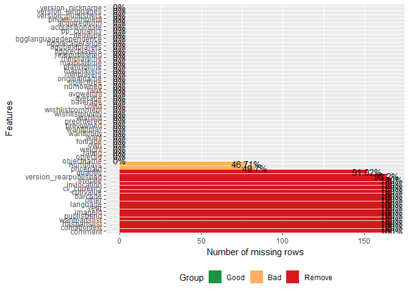
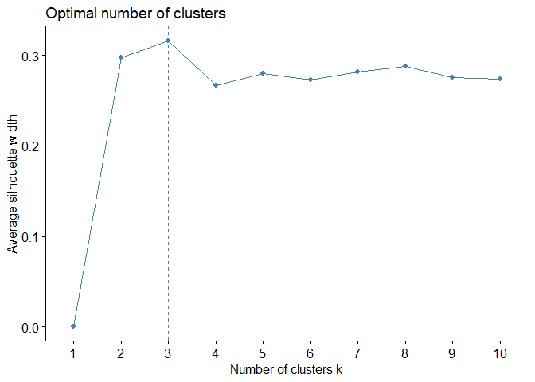
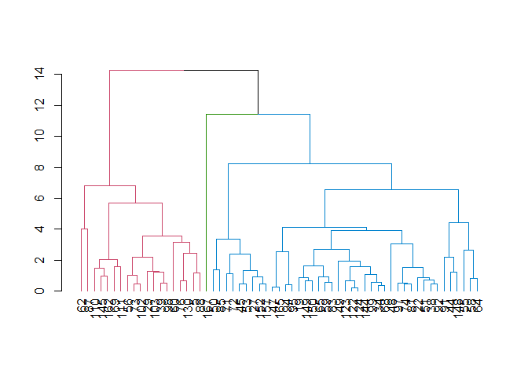
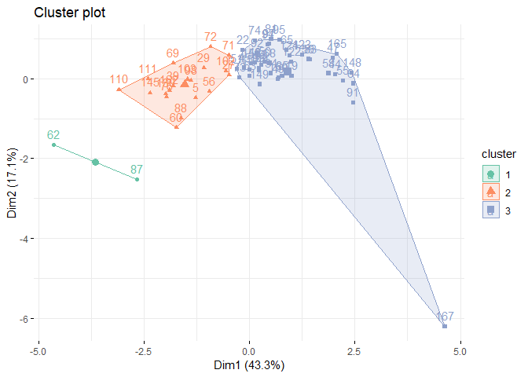
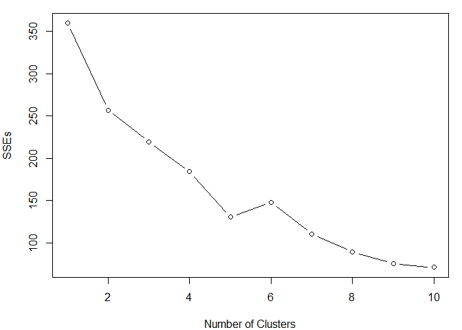
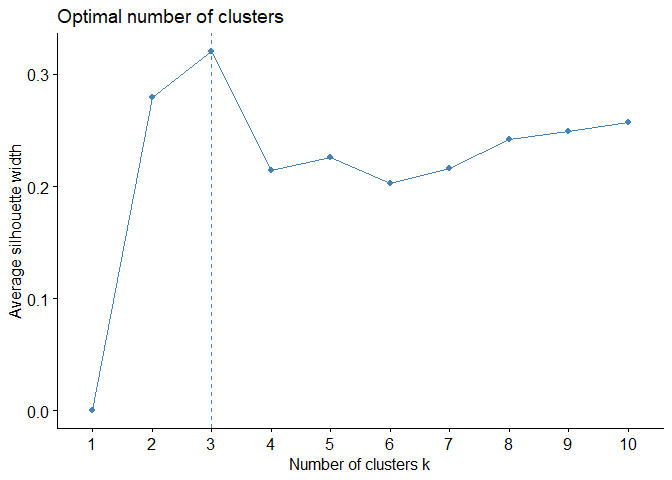
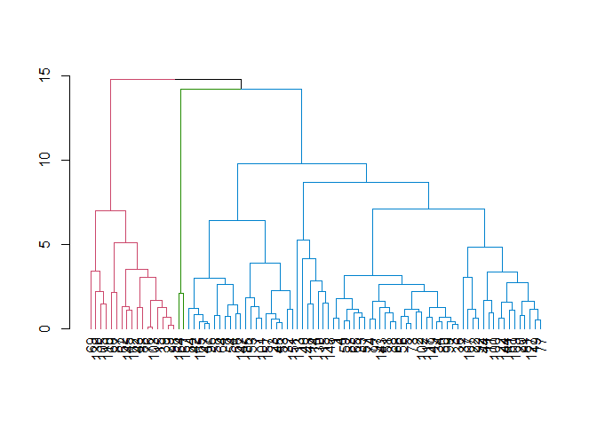
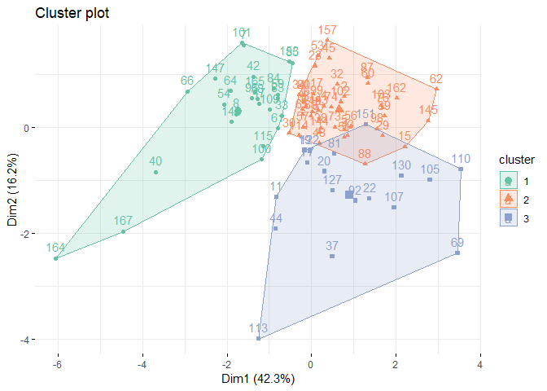
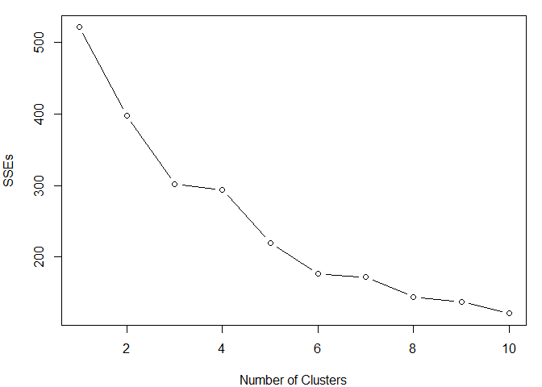

```r
library(DataExplorer)
```

```
## Warning: package 'DataExplorer' was built under R version 3.4.4
```

```r
library(tidyverse)
```

```
## Warning: package 'tidyverse' was built under R version 3.4.4
```

```
## -- Attaching packages ---------------------------------- tidyverse 1.2.1 --
```

```
## v ggplot2 3.0.0     v purrr   0.2.4
## v tibble  1.4.2     v dplyr   0.7.6
## v tidyr   0.8.1     v stringr 1.2.0
## v readr   1.1.1     v forcats 0.3.0
```

```
## Warning: package 'ggplot2' was built under R version 3.4.4
```

```
## Warning: package 'tibble' was built under R version 3.4.4
```

```
## Warning: package 'tidyr' was built under R version 3.4.4
```

```
## Warning: package 'readr' was built under R version 3.4.4
```

```
## Warning: package 'purrr' was built under R version 3.4.3
```

```
## Warning: package 'dplyr' was built under R version 3.4.4
```

```
## Warning: package 'stringr' was built under R version 3.4.3
```

```
## Warning: package 'forcats' was built under R version 3.4.4
```

```
## -- Conflicts ------------------------------------- tidyverse_conflicts() --
## x dplyr::filter() masks stats::filter()
## x dplyr::lag()    masks stats::lag()
```

```r
library(cluster)
library(factoextra)
```

```
## Warning: package 'factoextra' was built under R version 3.4.4
```

```
## Welcome! Related Books: `Practical Guide To Cluster Analysis in R` at https://goo.gl/13EFCZ
```

```r
library(dendextend)
```

```
## Warning: package 'dendextend' was built under R version 3.4.4
```

```
## 
## ---------------------
## Welcome to dendextend version 1.8.0
## Type citation('dendextend') for how to cite the package.
## 
## Type browseVignettes(package = 'dendextend') for the package vignette.
## The github page is: https://github.com/talgalili/dendextend/
## 
## Suggestions and bug-reports can be submitted at: https://github.com/talgalili/dendextend/issues
## Or contact: <tal.galili@gmail.com>
## 
## 	To suppress this message use:  suppressPackageStartupMessages(library(dendextend))
## ---------------------
```

```
## 
## Attaching package: 'dendextend'
```

```
## The following object is masked from 'package:stats':
## 
##     cutree
```

```r
library(dplyr)
```

# Introduction
The board game industry is an 9.6 billion industry, globally as of 2016, and constantly growing. Game analysis is sought by both the publishers and consumers. BoardGameGeek.com allows users to add their colletion information, including price paid, their ranking, and number of plays of each game owned. 

With sites like BGG.com making it available for hobbiest to publish their collections, data is readily available for publishers to evaluate groupings and clusters of games to potentially influence where to focus marketing for new games and kickstarter funding campaigns. 

# Data Pull
All collection information is manually entered over time and is unique to an individuals account. Some accounts are made public, so their collection is viewable by others. To download a .csv of my personal collection, go to https://boardgamegeek.com/collection/user/Astrodar?own=1&subtype=boardgame&ff=1 and click "owned" next to Download board games: above the table of games. This will initialize a download to your computer.

# Data Read
First we read the data into R, and look at which columns are majority missing values using the DataExplorer package. We remove those columns from our collection data.


```r
#collection <- read.csv("C:/Users/jamie/Downloads/BZAN552_FinalPortfolio/collection.csv")
collection <- read.csv("C:/Users/jamie/Documents/BZAN/BZAN-552--Final-Portfolio/collection.csv")
head(collection)
```

```
##            objectname objectid rating numplays weight own fortrade want
## 1           7 Wonders    68448    6.5        1      0   1        0    0
## 2     Above and Below   172818    8.0        2      0   1        0    0
## 3            Alhambra     6249    7.0        4      0   1        0    0
## 4  Android: Netrunner   124742    7.0        2      0   1        0    0
## 5       Arcadia Quest   155068    8.0        8      0   1        0    0
## 6 Arcadia Quest: Pets   188699    0.0       NA      0   1        0    0
##   wanttobuy wanttoplay prevowned preordered wishlist wishlistpriority
## 1         0          0         0          0        0                1
## 2         0          0         0          0        0                2
## 3         0          0         0          0        0                1
## 4         0          0         0          0        0                1
## 5         0          0         0          0        0                4
## 6         0          0         0          0        0                3
##            wishlistcomment comment conditiontext haspartslist
## 1              LP: 2016-01      NA            NA           NA
## 2              LP: 2016-03      NA            NA           NA
## 3              LP: 2017-01      NA            NA           NA
## 4 LP: 2017-06\n\nJ - likes      NA            NA           NA
## 5                               NA            NA           NA
## 6                               NA            NA           NA
##   wantpartslist   collid baverage average avgweight rank numowned
## 1            NA 31735732  7.69975 7.78972    2.3405   44    85429
## 2            NA 33196748  7.27584 7.53674    2.5474  173    14293
## 3            NA 31739252  6.93236 7.03274    2.1150  410    29006
## 4            NA 31735716  7.72281 7.90829    3.3656   43    37162
## 5            NA 44224996  7.45799 7.85173    2.5128   94    11951
## 6            NA 52920074  6.17986 8.51354    2.0000    0     2694
##   objecttype        originalname minplayers maxplayers playingtime
## 1      thing           7 Wonders          2          7          30
## 2      thing     Above and Below          2          4          90
## 3      thing            Alhambra          2          6          60
## 4      thing  Android: Netrunner          2          2          45
## 5      thing       Arcadia Quest          2          4          60
## 6      thing Arcadia Quest: Pets          2          4         120
##   maxplaytime minplaytime yearpublished bggrecplayers bggbestplayers
## 1          30          30          2010     3,4,5,6,7              4
## 2          90          90          2015         2,3,4              3
## 3          60          45          2003       2,3,4,5              3
## 4          45          45          2012             2              2
## 5          60          60          2014         2,3,4              4
## 6         120          60          2017         2,3,4              4
##   bggrecagerange
## 1            10+
## 2            10+
## 3             8+
## 4            12+
## 5            10+
## 6               
##                                              bgglanguagedependence
## 1                                        No necessary in-game text
## 2 Extensive use of text - massive conversion needed to be playable
## 3                                        No necessary in-game text
## 4 Extensive use of text - massive conversion needed to be playable
## 5            Moderate in-game text - needs crib sheet or paste ups
## 6                                                                 
##   publisherid imageid year language other   itemtype barcode pricepaid
## 1          NA      NA   NA       NA    NA standalone      NA        NA
## 2          NA      NA   NA       NA    NA standalone      NA        NA
## 3          NA      NA   NA       NA    NA standalone      NA        NA
## 4          NA      NA   NA       NA    NA standalone      NA        NA
## 5          NA      NA   NA       NA    NA standalone      NA     79.99
## 6          NA      NA   NA       NA    NA  expansion      NA     46.99
##   pp_currency currvalue cv_currency acquisitiondate acquiredfrom quantity
## 1                    NA          NA                                    NA
## 2                    NA          NA                                    NA
## 3                    NA          NA      2014-07-12 Nicole Quist       NA
## 4                    NA          NA                                    NA
## 5         USD        NA          NA      2018-07-14  Sci-Fi City       NA
## 6         USD        NA          NA      2018-07-14  Sci-Fi City       NA
##             privatecomment invlocation invdate version_publishers
## 1 Pre-Marriage Acquisition          NA      NA                   
## 2      Won at Andocon 2015          NA      NA                   
## 3                     Gift          NA      NA                   
## 4 Pre-Marriage Acquisition          NA      NA                   
## 5                                   NA      NA                   
## 6                                   NA      NA                   
##   version_languages version_yearpublished version_nickname
## 1                                      NA                 
## 2                                      NA                 
## 3                                      NA                 
## 4                                      NA                 
## 5                                      NA                 
## 6                                      NA
```

```r
DataExplorer::plot_missing(collection)
```

<!-- -->

```r
remove_cols <- c("quantity", "version_yearpublished", "invdate", "invlocation", "cv_currency", "currvalue", "barcode", "other", "language", "year", "imageid" , "publisherid", "wantpartslist", "haspartslist", "conditiontext", "comment")

collection <- collection[ , !(names(collection) %in% remove_cols)]
```

# Data Insight
Because this data is based on my personal game collection, the set isn't very large. I own 167 unique games and expansions. However, because I track number of plays to determine how many games I've played in a year, I don't track expansion plays when they are used in conjunction with the base game. 

To perform cluster analysis, I am intersted in the continuous variables only that I think would play a roll in clustering board games. 

Unfortunately, a lot of my collection were gifts and I dont have the price paid for half of my collection. I am interested in clustering based on price and number of plays but in conjunction, there are few games that overlap to produce good clusters.

# Data Subsets
I separate into two data subsets and I will perform separate cluster analysis on the two data subsets - (1) with price paid and without number of plays (2) with number of plays and without price plid. 


```r
# Continuous variables only
continuous <- c("rating", "numplays", "baverage", "minplayers", "maxplayers", "playingtime", "pricepaid")
col_cont <- collection[continuous]

# DATA SUBSETS

##------------##
## Price Paid ##
##------------##
# Where we know the price paid
summary(collection$pricepaid)
```

```
##    Min. 1st Qu.  Median    Mean 3rd Qu.    Max.    NA's 
##    5.99   14.93   18.80   27.23   34.60  129.99      83
```

```r
known_price <- collection[which(!is.na(collection$pricepaid)),]
pri_cont <- known_price[continuous]

## How many na values do we have in this data
sum(sapply(pri_cont, is.na))
```

```
## [1] 36
```

```r
sum(sapply(pri_cont, is.infinite))
```

```
## [1] 0
```

```r
sum(sapply(pri_cont, is.nan))
```

```
## [1] 0
```

```r
# There are too many NA values in num plays for the data set where we know the price paid - so we can remove that column
pri_cont <- pri_cont[,-which(names(pri_cont) == "numplays")]
sum(sapply(pri_cont, is.na))
```

```
## [1] 0
```

```r
##--------------##
## Number Plays ##
##--------------##
# Games we've played
# Expansions to games are never marked as "played" unless they can be played as a stand-alone game
num_plays <- collection[which(!is.na(collection$numplays)),]
play_cont <- num_plays[continuous]

## How many na values do we have in this data
sum(sapply(play_cont, is.na))
```

```
## [1] 41
```

```r
sum(sapply(play_cont, is.infinite))
```

```
## [1] 0
```

```r
sum(sapply(play_cont, is.nan))
```

```
## [1] 0
```

```r
# There are too many NA values in num plays for the data set where we know the price paid - so we can remove that column
play_cont <- play_cont[,-which(names(play_cont) == "pricepaid")]
sum(sapply(play_cont, is.na))
```

```
## [1] 0
```

# Hierarchical Agglomerative Clustering with Price Data Subset
First, I perform agglomerative (bottom up) clustering on my price data subset. I noticed after my first run that if a personal rating for that game did not exist then it was marked zero, rather than NA. So I reduce the data subset to not include unrated games.

I ensure there are no NA, infiniate, or NaN values in the data set and only use complete cases in my analysis. This reduced set is 61 observations, compared to 167 observations from the full collection. The data is scaled to standardize all variables. This ensures one column is not weighted much higher than another column due to original scale of the data and change in values.

There are multiple methods that can be used in hierarchical clustering. Here, I assess the average, single ,complete, and ward methods to determine which method has the highest agglomerative coefficient (AC). The AC measures the strength of the clustering structure. The closer the cluster structure is to 1, the better. Here, the ward method provides the highest AC so this is the method I choose to proceed with in my clustering. 

To determine the optimal number of clusters, I use the silhouette calculation that produces a plot of the number of clusters versus the average sihoulette width. The average sihouette method measure the quality of clustering, like the agglomerative coefficient used above. Used together, we can determine how well each object lies within its cluster. A high average sihouette indicates good clustering. Three is determined to be the optimal number of clusters, as it produces the highest average sihouette width.  

Finally, building my fit, I use the euclidean distance as the metric for measuring distance between elements to be merged and the ward.D2 method to lead to the minimum increase in total within-cluster variance after merging. Usually, the closest elements by distance that minimize the total within-cluster variance are merged to create a new cluster. This step is repeated for all points until they all join to one at the very top of the dendogram. 


```r
# BGG changes ratings to 0 if they haven't been rated
# Must change these to NAs
pri_cont <- pri_cont[which(!pri_cont$rating == "0"),]


# How many na values do we have in this data
sum(sapply(pri_cont, is.na))
```

```
## [1] 0
```

```r
sum(sapply(pri_cont, is.infinite))
```

```
## [1] 0
```

```r
sum(sapply(pri_cont, is.nan))
```

```
## [1] 0
```

```r
# Keep only complete classes
pri_cont_complete <- pri_cont[complete.cases(pri_cont),]

# Standardize all variables
pri_cont_scale  <- scale(pri_cont_complete)

# Which method is most appropriate for clustering? 
m <- c( "average", "single", "complete", "ward")
names(m) <- c( "average", "single", "complete", "ward")

# Function to compute agglomerative coefficient - measures the amount of clustering structure found
ac <- function(x) {
  agnes(pri_cont_scale, method = x, metric = "euclidean")$ac
}

map_dbl(m, ac)
```

```
##   average    single  complete      ward 
## 0.8668924 0.8699946 0.8921362 0.9155601
```

```r
# Determine Optimal Number of Clusters - Three is determined to be best by the silhouette calculation
fviz_nbclust(pri_cont_scale, hcut, method = "silhouette", hc_method = "ward.D2")
```

<!-- -->

```r
d <- dist(pri_cont_scale, method = "euclidian") # distance matrix
fit <- hclust(d, method="ward.D2")

## Display Dendogram ##
avg_dend_obj <- as.dendrogram(fit)
avg_col_dend <- color_branches(avg_dend_obj, h = 10)
plot(avg_col_dend)
```

<!-- -->

# Three Clusters on Price Data Subset
I cut the into three clusters, as determined optimal, and add that cluster ID back into the original data for further analysis. First, I summarize the clusters by mean values of each continuous variable to see how the clusters are different. 

The three clusters have very different average price points and playing times. The max players and min players are, however, very similar. Cluster 1 seems to have higher ratings, higher playing times and higher price paid. While cluster 2 seems to be middle ground between 1 and 3. Cluster three is made up of 1 game that is an outlier in the data with a very low rating and very low price that plays very quickly. 

Then, we can look at the game names and other statistics that were not used in the cluster analysis. Upon looking at the name of the games in each respective cluster, it is obvious to me why they were grouped like this. Cluster 1 includes some of my favorite games, games I was willing to pay a lot more for and that take a longer time to play. The ratings are highest because they are the games I have enjoyed the most in my collection. Cluster 2 includes a lot of games I really enjoy, but they play a little quicker and I haven't paid nearly as much for these games. Cluster 3 is a game, Zombie Dice, I got from a sale on International Table Top day. The sale was really good and my price paid was really low. Overall, the game was okay, but it isn't one that hits the table a lot anymore.


```r
# cluster ID for each observation when cutting tree into 3 clusters
k3 <- cutree(fit, k=3) 

k3 <- as.factor(k3)
length(k3)
```

```
## [1] 61
```

```r
nrow(pri_cont_complete)
```

```
## [1] 61
```

```r
# Add the cluster number as a column in my data so we can group by
pri_cont_complete$k3 <- k3

pri_cont_complete %>%
  group_by(k3) %>%
  summarise_all("mean")
```

```
## # A tibble: 3 x 7
##   k3    rating baverage minplayers maxplayers playingtime pricepaid
##   <fct>  <dbl>    <dbl>      <dbl>      <dbl>       <dbl>     <dbl>
## 1 1       8.42     7.68       1.63       4.58       107       54.7 
## 2 2       7.28     6.70       1.85       4.56        46.6     20.7 
## 3 3       4.00     6.11       2.00      99.0         20.0      7.99
```

```r
# Add the cluster number back into the original dataset for easy distinction
known_price_complete <- known_price[which(!known_price$rating == "0"),]
nrow(known_price_complete)
```

```
## [1] 61
```

```r
known_price_complete$k3 <- k3

# Games in cluster 1
known_price_complete$objectname[which(known_price_complete$k3 == 1)]
```

```
##  [1] Arcadia Quest                         
##  [2] The Castles of Burgundy               
##  [3] Concordia                             
##  [4] Five Tribes                           
##  [5] Fury of Dracula (third/fourth edition)
##  [6] Gloomhaven                            
##  [7] Imperial Settlers                     
##  [8] Istanbul                              
##  [9] Kemet                                 
## [10] Massive Darkness                      
## [11] Mechs vs. Minions                     
## [12] Orléans                              
## [13] Race for the Galaxy                   
## [14] Raiders of the North Sea              
## [15] Scythe                                
## [16] Scythe: Invaders from Afar            
## [17] Star Wars: Armada                     
## [18] Terraforming Mars                     
## [19] Viticulture Essential Edition         
## 167 Levels: 7 Wonders ... Zombie Dice
```

```r
table(known_price_complete$itemtype[which(known_price_complete$k3 == 1)])
```

```
## 
##  expansion standalone 
##          1         18
```

```r
table(droplevels(known_price_complete$acquiredfrom[which(known_price_complete$k3 == 1)]))
```

```
## 
##                                      Amazon          CoolStuffInc 
##                     1                     2                     3 
##      Coolstuffinc.com           Kickstarter            Riot Games 
##                     7                     1                     1 
##           Sci-Fi City Sci-Fi City Knoxville      The Raven's Nest 
##                     1                     2                     1
```

```r
known_price_complete[which(known_price_complete$k3 == 1),]
```

```
##                                 objectname objectid rating numplays weight
## 5                            Arcadia Quest   155068    8.0        8      0
## 29                 The Castles of Burgundy    84876    8.5        8      0
## 39                               Concordia   124361    9.0        4      0
## 56                             Five Tribes   157354    7.5        7      0
## 60  Fury of Dracula (third/fourth edition)   181279    7.0        1      0
## 62                              Gloomhaven   174430    9.0        6      0
## 69                       Imperial Settlers   154203   10.0       46      0
## 73                                Istanbul   148949    7.5        7      0
## 76                                   Kemet   127023    9.0        4      0
## 87                        Massive Darkness   197070    6.0       11      0
## 88                       Mechs vs. Minions   209010    7.0       15      0
## 98                                Orléans   164928    8.5        7      0
## 102                    Race for the Galaxy    28143    8.0        1      0
## 103               Raiders of the North Sea   170042    9.0        4      0
## 110                                 Scythe   169786   10.0       25      0
## 111             Scythe: Invaders from Afar   199727   10.0       NA      0
## 130                      Star Wars: Armada   163745    9.0       21      0
## 145                      Terraforming Mars   167791    8.5       14      0
## 162          Viticulture Essential Edition   183394    8.5        9      0
##     own fortrade want wanttobuy wanttoplay prevowned preordered wishlist
## 5     1        0    0         0          0         0          0        0
## 29    1        0    0         0          0         0          0        0
## 39    1        0    0         0          0         0          0        0
## 56    1        0    0         0          0         0          0        0
## 60    1        0    0         0          0         0          0        0
## 62    1        0    0         0          0         0          0        0
## 69    1        0    0         0          0         0          0        0
## 73    1        0    0         0          0         0          0        0
## 76    1        0    0         0          0         0          0        0
## 87    1        0    0         0          0         0          0        0
## 88    1        0    0         0          0         0          0        0
## 98    1        0    0         0          0         0          0        0
## 102   1        0    0         0          0         0          0        0
## 103   1        0    0         0          0         0          0        0
## 110   1        0    0         0          0         0          0        0
## 111   1        0    0         0          0         0          0        0
## 130   1        0    0         0          0         0          0        0
## 145   1        0    0         0          0         0          0        0
## 162   1        0    0         0          0         0          0        0
##     wishlistpriority wishlistcomment   collid baverage average avgweight
## 5                  4                 44224996  7.45799 7.85173    2.5128
## 29                 3                 41243913  8.00982 8.12743    3.0230
## 39                 4                 39904565  7.90811 8.08684    3.0922
## 56                 4     LP: 2017-11 40165708  7.64689 7.78835    2.8890
## 60                 1     LP: 2017-06 39576812  7.26128 7.59173    3.1937
## 62                 1                 42222904  8.61850 8.92766    3.7687
## 69                 3                 33589637  7.32491 7.49386    2.7709
## 73                 2     LP: 2017-05 39899765  7.47258 7.62148    2.5862
## 76                 2                 39899761  7.52541 7.75569    2.9890
## 87                 3                 45058136  6.69233 7.46018    2.5510
## 88                 3     LP: 2017-07 38385616  7.83810 8.16506    2.4570
## 98                 2                 39576727  7.86997 8.08355    3.0942
## 102                2                 43381420  7.66869 7.76282    2.9765
## 103                3                 50344322  7.43794 7.81840    2.5773
## 110                2                 39576690  8.11085 8.28365    3.3668
## 111                3                 44368508  7.74810 8.42352    3.3636
## 130                1     LP: 2017-12 45648977  7.22402 7.92239    3.1297
## 145                2                 39904555  8.22253 8.39094    3.2360
## 162                2                 39899750  7.91734 8.14847    2.9203
##     rank numowned objecttype                           originalname
## 5     94    11951      thing                          Arcadia Quest
## 29    11    47734      thing                The Castles of Burgundy
## 39    20    20601      thing                              Concordia
## 56    56    31123      thing                            Five Tribes
## 60   181    14394      thing Fury of Dracula (third/fourth edition)
## 62     1    33891      thing                             Gloomhaven
## 69   143    22177      thing                      Imperial Settlers
## 73    91    23168      thing                               Istanbul
## 76    77    14684      thing                                  Kemet
## 87   660     6828      thing                       Massive Darkness
## 88    29    15769      thing                      Mechs vs. Minions
## 98    26    16899      thing                               Orléans
## 102   48    47189      thing                    Race for the Galaxy
## 103  103    10293      thing               Raiders of the North Sea
## 110    7    44828      thing                                 Scythe
## 111    0    17327      thing             Scythe: Invaders from Afar
## 130  196     7536      thing                      Star Wars: Armada
## 145    4    41242      thing                      Terraforming Mars
## 162   19    19954      thing          Viticulture Essential Edition
##     minplayers maxplayers playingtime maxplaytime minplaytime
## 5            2          4          60          60          60
## 29           2          4          90          90          30
## 39           2          5         100         100         100
## 56           2          4          80          80          40
## 60           2          5         180         180         120
## 62           1          4         120         120          60
## 69           1          4          90          90          45
## 73           2          5          60          60          40
## 76           2          5         120         120          90
## 87           1          6         180         180          90
## 88           2          4          90          90          60
## 98           2          4          90          90          90
## 102          2          4          60          60          30
## 103          2          4         120         120          60
## 110          1          5         115         115          90
## 111          1          7         140         140          90
## 130          2          2         120         120         120
## 145          1          5         120         120         120
## 162          1          6          90          90          45
##     yearpublished bggrecplayers bggbestplayers bggrecagerange
## 5            2014         2,3,4              4            10+
## 29           2011         2,3,4              2            12+
## 39           2013       2,3,4,5              4            12+
## 56           2014         2,3,4              2            12+
## 60           2015       2,3,4,5            3,5            12+
## 62           2017       1,2,3,4              3            14+
## 69           2014       1,2,3,4              2            12+
## 73           2014       2,3,4,5              4            10+
## 76           2012         3,4,5            4,5            12+
## 87           2017       1,2,3,4              4            10+
## 88           2016         2,3,4              4            10+
## 98           2014         2,3,4              4            12+
## 102          2007         2,3,4              2            12+
## 103          2015         2,3,4              3            12+
## 110          2016     1,2,3,4,5              4            12+
## 111          2016 1,2,3,4,5,6,7            4,5            12+
## 130          2015             2              2            10+
## 145          2016       1,2,3,4              3            12+
## 162          2015   1,2,3,4,5,6            3,4            12+
##                                                bgglanguagedependence
## 5              Moderate in-game text - needs crib sheet or paste ups
## 29                                         No necessary in-game text
## 39             Moderate in-game text - needs crib sheet or paste ups
## 56                                         No necessary in-game text
## 60  Extensive use of text - massive conversion needed to be playable
## 62  Extensive use of text - massive conversion needed to be playable
## 69             Moderate in-game text - needs crib sheet or paste ups
## 73                                         No necessary in-game text
## 76                                         No necessary in-game text
## 87        Some necessary text - easily memorized or small crib sheet
## 88             Moderate in-game text - needs crib sheet or paste ups
## 98                                         No necessary in-game text
## 102       Some necessary text - easily memorized or small crib sheet
## 103            Moderate in-game text - needs crib sheet or paste ups
## 110            Moderate in-game text - needs crib sheet or paste ups
## 111       Some necessary text - easily memorized or small crib sheet
## 130 Extensive use of text - massive conversion needed to be playable
## 145            Moderate in-game text - needs crib sheet or paste ups
## 162            Moderate in-game text - needs crib sheet or paste ups
##       itemtype pricepaid pp_currency acquisitiondate          acquiredfrom
## 5   standalone     79.99         USD      2018-07-14           Sci-Fi City
## 29  standalone     21.84         USD      2017-04-24                Amazon
## 39  standalone     49.99         USD      2017-08-08          CoolStuffInc
## 56  standalone     50.99         USD      2017-02-06      Coolstuffinc.com
## 60  standalone     50.00         USD      2016-12-11                      
## 62  standalone    129.99         USD      2018-03-03 Sci-Fi City Knoxville
## 69  standalone     34.49         USD      2017-01-23      Coolstuffinc.com
## 73  standalone     34.49         USD      2017-01-23      Coolstuffinc.com
## 76  standalone     59.49         USD      2017-02-06      Coolstuffinc.com
## 87  standalone    110.00         USD      2017-08-29           Kickstarter
## 88  standalone     80.00         USD      2016-10-13            Riot Games
## 98  standalone     42.99         USD      2018-04-14      Coolstuffinc.com
## 102 standalone     34.95         USD      2018-02-01 Sci-Fi City Knoxville
## 103 standalone     35.99         USD      2018-04-14      Coolstuffinc.com
## 110 standalone     56.99         USD      2017-08-02          CoolStuffInc
## 111  expansion     20.49         USD      2017-08-08          CoolStuffInc
## 130 standalone     68.85         USD      2017-10-05      The Raven's Nest
## 145 standalone     34.99         USD      2018-04-25                Amazon
## 162 standalone     42.99         USD      2018-05-04      Coolstuffinc.com
##                               privatecomment version_publishers
## 5                                                              
## 29                                                             
## 39                                                             
## 56                                                             
## 60  From: Jamie\nTo: Darren\nChristmas 2016!                   
## 62                                                             
## 69                                                             
## 73                                                             
## 76                                                             
## 87                                                             
## 88                                                             
## 98                                                             
## 102                                                            
## 103                                                            
## 110                                                            
## 111                                                            
## 130                                                            
## 145          International Tabletop Day 2018                   
## 162                                                            
##     version_languages version_nickname k3
## 5                                       1
## 29                                      1
## 39                                      1
## 56                                      1
## 60                                      1
## 62                                      1
## 69                                      1
## 73                                      1
## 76                                      1
## 87                                      1
## 88                                      1
## 98                                      1
## 102                                     1
## 103                                     1
## 110                                     1
## 111                                     1
## 130                                     1
## 145                                     1
## 162                                     1
```

```r
# Games in cluster 2
known_price_complete$objectname[which(known_price_complete$k3 == 2)]
```

```
##  [1] Bohnanza                                                       
##  [2] Carcassonne                                                    
##  [3] Castle Panic: The Wizard's Tower                               
##  [4] Century: Golem Edition                                         
##  [5] Colt Express                                                   
##  [6] Diamant                                                        
##  [7] Dice City                                                      
##  [8] Doctor Who Fluxx                                               
##  [9] Dogs of War                                                    
## [10] Dominion Big Box (English)                                     
## [11] Escape: The Curse of the Temple – Big Box                    
## [12] Ethnos                                                         
## [13] Explorers of the North Sea                                     
## [14] Five Crowns                                                    
## [15] Forbidden Island                                               
## [16] The Fox in the Forest                                          
## [17] Guillotine                                                     
## [18] Hive Pocket                                                    
## [19] Imhotep                                                        
## [20] Imperial Settlers: Aztecs                                      
## [21] Imperial Settlers: Why Can't We Be Friends                     
## [22] Jaipur                                                         
## [23] Kingdomino                                                     
## [24] Love Letter                                                    
## [25] Magic Maze                                                     
## [26] Munchkin Zombies                                               
## [27] Mystic Vale                                                    
## [28] Mystic Vale: Vale of Magic                                     
## [29] Mystic Vale: Vale of the Wild                                  
## [30] Onitama                                                        
## [31] Photosynthesis                                                 
## [32] Smash Up                                                       
## [33] Smash Up: Cease and Desist                                     
## [34] Smash Up: Monster Smash                                        
## [35] Tak                                                            
## [36] Thief's Market                                                 
## [37] Ticket to Ride                                                 
## [38] Ticket to Ride Map Collection: Volume 2 – India & Switzerland
## [39] Tiny Epic Galaxies: Beyond the Black                           
## [40] Unlock! The Formula                                            
## [41] Why First?                                                     
## 167 Levels: 7 Wonders ... Zombie Dice
```

```r
table(known_price_complete$itemtype[which(known_price_complete$k3 == 2)])
```

```
## 
##  expansion standalone 
##          7         34
```

```r
table(droplevels(known_price_complete$acquiredfrom[which(known_price_complete$k3 == 2)]))
```

```
## 
##                                      Amazon          CoolStuffInc 
##                     1                    19                     5 
##      Coolstuffinc.com             McGuire's       MiniatureMarket 
##                     8                     1                     1 
## Sci-Fi City Knoxville 
##                     6
```

```r
known_price_complete[which(known_price_complete$k3 == 2),]
```

```
##                                                          objectname
## 19                                                         Bohnanza
## 22                                                      Carcassonne
## 27                                 Castle Panic: The Wizard's Tower
## 34                                           Century: Golem Edition
## 38                                                     Colt Express
## 44                                                          Diamant
## 45                                                        Dice City
## 47                                                 Doctor Who Fluxx
## 48                                                      Dogs of War
## 49                                       Dominion Big Box (English)
## 50                      Escape: The Curse of the Temple – Big Box
## 51                                                           Ethnos
## 53                                       Explorers of the North Sea
## 55                                                      Five Crowns
## 58                                                 Forbidden Island
## 59                                            The Fox in the Forest
## 64                                                       Guillotine
## 65                                                      Hive Pocket
## 68                                                          Imhotep
## 71                                        Imperial Settlers: Aztecs
## 72                       Imperial Settlers: Why Can't We Be Friends
## 74                                                           Jaipur
## 81                                                       Kingdomino
## 83                                                      Love Letter
## 85                                                       Magic Maze
## 91                                                 Munchkin Zombies
## 92                                                      Mystic Vale
## 94                                       Mystic Vale: Vale of Magic
## 95                                    Mystic Vale: Vale of the Wild
## 97                                                          Onitama
## 99                                                   Photosynthesis
## 122                                                        Smash Up
## 123                                      Smash Up: Cease and Desist
## 124                                         Smash Up: Monster Smash
## 144                                                             Tak
## 148                                                  Thief's Market
## 149                                                  Ticket to Ride
## 150 Ticket to Ride Map Collection: Volume 2 – India & Switzerland
## 152                            Tiny Epic Galaxies: Beyond the Black
## 157                                             Unlock! The Formula
## 165                                                      Why First?
##     objectid rating numplays weight own fortrade want wanttobuy wanttoplay
## 19        11    6.5       13      0   1        0    0         0          0
## 22       822    9.0       23      0   1        0    0         0          0
## 27    104590    8.0       NA      0   1        0    0         0          0
## 34    232832    7.0        1      0   1        0    0         0          0
## 38    158899    8.0        8      0   1        0    0         0          0
## 44     15512    6.0       21      0   1        0    0         0          0
## 45    179572    8.0        5      0   1        0    0         0          0
## 47    235365    7.0        7      0   1        0    0         0          0
## 48    158435    9.0        4      0   1        0    0         0          0
## 49    142131    7.0       NA      0   1        0    0         0          0
## 50    157820    8.0       NA      0   1        0    0         0          0
## 51    206718    8.5       10      0   1        0    0         0          0
## 53    176371    7.5        5      0   1        0    0         0          0
## 55      1472    5.0       NA      0   1        0    0         0          0
## 58     65244    5.0        3      0   1        0    0         0          0
## 59    221965    6.0        2      0   1        0    0         0          0
## 64       116    4.0        2      0   1        0    0         0          0
## 65    154597    7.0        5      0   1        0    0         0          0
## 68    191862    7.5        6      0   1        0    0         0          0
## 71    202459    9.5       NA      0   1        0    0         0          0
## 72    169075   10.0       NA      0   1        0    0         0          0
## 74     54043    8.5        3      0   1        0    0         0          0
## 81    204583    8.5       13      0   1        0    0         0          0
## 83    129622    6.0        1      0   1        0    0         0          0
## 85    209778    6.5        2      0   1        0    0         0          0
## 91     86955    4.0       NA      0   1        0    0         0          0
## 92    194607    8.5       25      0   1        0    0         0          0
## 94    207591    9.0       NA      0   1        0    0         0          0
## 95    220502    9.0       NA      0   1        0    0         0          0
## 97    160477    8.0        6      0   1        0    0         0          0
## 99    218603    7.5        3      0   1        0    0         0          0
## 122   122522    7.0       15      0   1        0    0         0          0
## 123   198487    7.0       NA      0   1        0    0         0          0
## 124   160018    7.0       NA      0   1        0    0         0          0
## 144   197405    7.5       12      0   1        0    0         0          0
## 148   182351    5.5        1      0   1        0    0         0          0
## 149     9209    6.5        4      0   1        0    0         0          0
## 150   106645    6.0       NA      0   1        0    0         0          0
## 152   200544    8.0       NA      0   1        0    0         0          0
## 157   216091    8.0        1      0   1        0    0         0          0
## 165   171672    7.0        4      0   1        0    0         0          0
##     prevowned preordered wishlist wishlistpriority
## 19          0          0        0                3
## 22          0          0        0                1
## 27          0          0        0                1
## 34          0          0        0                1
## 38          0          0        0                1
## 44          0          0        0                1
## 45          0          0        0                3
## 47          0          0        0                3
## 48          0          0        0                1
## 49          0          0        0                1
## 50          0          0        0                1
## 51          0          0        0                3
## 53          0          0        0                1
## 55          0          0        0                1
## 58          0          0        0                1
## 59          0          0        0                3
## 64          0          0        0                1
## 65          0          0        0                1
## 68          0          0        0                3
## 71          0          0        0                1
## 72          0          0        0                1
## 74          0          0        0                1
## 81          0          0        0                3
## 83          0          0        0                1
## 85          0          0        0                3
## 91          0          0        0                1
## 92          0          0        0                2
## 94          0          0        0                3
## 95          0          0        0                3
## 97          0          0        0                3
## 99          0          0        0                2
## 122         0          0        0                1
## 123         0          0        0                3
## 124         0          0        0                3
## 144         0          0        0                3
## 148         0          0        0                1
## 149         0          0        0                1
## 150         0          0        0                1
## 152         0          0        0                3
## 157         0          0        0                3
## 165         0          0        0                3
##                                       wishlistcomment   collid baverage
## 19                                        LP: 2017-08 33589670  6.95731
## 22                                                    39576792  7.32816
## 27                                                    32355921  6.89047
## 34                                                    50345183  7.04766
## 38                                        LP: 2017-09 40341769  7.03568
## 44                                        LP: 2017-09 39899899  6.71564
## 45                                                    44225399  6.50093
## 47                                                    51464576  5.67969
## 48                                        LP: 2017-06 33589436  6.70008
## 49          LP: 2017-04\n\nPlays Recorded as Dominion 39995353  6.38008
## 50  Plays Recorded as Escape: The Curse of the Temple 39273950  6.58831
## 51                                        LP: 2017-08 43214678  7.17456
## 53                                                    51421804  6.36725
## 55                                        NP: 2016-01 32356033  5.69262
## 58                    LP: 2017-10\n\nJ - doesn't like 32839032  6.73753
## 59                                                    50345125  6.90281
## 64                                        LP: 2016-03 33233162  6.42574
## 65                                        LP: 2017-05 32196637  7.23700
## 68                                                    39904699  6.98386
## 71                                                    44210731  6.07238
## 72                                                    44210728  6.72510
## 74                                        LP: 2017-04 31874656  7.40566
## 81                                        LP: 2017-09 44210770  7.24257
## 83                                        LP: 2016-11 31738751  7.18244
## 85                                                    50344847  7.00304
## 91                                        NP: 2016-01 32355948  5.95339
## 92                                                    39899882  6.96328
## 94                                                    50284172  6.38904
## 95                                                    50284174  6.27683
## 97                                        LP: 2017-09 44368494  7.24613
## 99                                                    50344860  7.02882
## 122                                                   32355858  6.67628
## 123            Plays recorded as Smash Up (base game) 49328362  6.31608
## 124            Plays recorded as Smash Up (base game) 49328372  6.73200
## 144                                                   51464648  6.60385
## 148                                       LP: 2017-04 40005378  6.04958
## 149                                                   31735829  7.35380
## 150                                                   32355944  7.28562
## 152                                                   52332815  6.60452
## 157                                                   44245773  6.46216
## 165                                                   50284151  5.75494
##     average avgweight rank numowned objecttype
## 19  7.05017    1.6744  382    46671      thing
## 22  7.43087    1.9278  141   114955      thing
## 27  7.49811    2.0654    0     7837      thing
## 34  7.79976    1.6250  304     4750      thing
## 38  7.17364    1.8141  317    24740      thing
## 44  6.83021    1.1120  642    17286      thing
## 45  6.85970    2.0449  897     6116      thing
## 47  6.98759    2.0000 4453      723      thing
## 48  7.52644    2.6479  655     2844      thing
## 49  7.91589    2.7805    0     2038      thing
## 50  7.65071    1.4524    0     3208      thing
## 51  7.54689    2.0110  228     7152      thing
## 53  7.39257    2.0345 1129     2650      thing
## 55  5.89835    1.2500 4273     3972      thing
## 58  6.82473    1.7394  614    56276      thing
## 59  7.45243    1.5938  442     6782      thing
## 64  6.53787    1.2727 1019    24041      thing
## 65  7.67984    2.3730    0    11515      thing
## 68  7.24231    2.0132  365    10790      thing
## 71  7.71453    2.7500    0     3221      thing
## 72  7.66940    2.5962    0     7249      thing
## 74  7.52174    1.5184  112    36253      thing
## 81  7.40027    1.2086  188    28124      thing
## 83  7.26578    1.1981  220    75058      thing
## 85  7.24813    1.6875  347    13493      thing
## 91  6.26716    1.9500 2334     7266      thing
## 92  7.29967    2.2976  378     9014      thing
## 94  7.64343    2.2222    0     3160      thing
## 95  8.04653    2.5000    0     2458      thing
## 97  7.52418    1.6911  185    14045      thing
## 99  7.29728    2.3114  322    13724      thing
## 122 6.82254    2.0560  669    32405      thing
## 123 7.55813    3.0000 1239     3651      thing
## 124 7.38160    2.2821  619     8272      thing
## 144 7.84669    2.5455  767     2509      thing
## 148 6.59217    1.8621 1968     3400      thing
## 149 7.45379    1.8661  134    74849      thing
## 150 7.81707    2.0123    0    10327      thing
## 152 7.87799    2.7273    0     6746      thing
## 157 7.16329    2.3158  964     2909      thing
## 165 6.12830    1.1379 3603     1262      thing
##                                                        originalname
## 19                                                         Bohnanza
## 22                                                      Carcassonne
## 27                                 Castle Panic: The Wizard's Tower
## 34                                           Century: Golem Edition
## 38                                                     Colt Express
## 44                                                          Diamant
## 45                                                        Dice City
## 47                                                 Doctor Who Fluxx
## 48                                                      Dogs of War
## 49                                       Dominion Big Box (English)
## 50                      Escape: The Curse of the Temple – Big Box
## 51                                                           Ethnos
## 53                                       Explorers of the North Sea
## 55                                                      Five Crowns
## 58                                                 Forbidden Island
## 59                                            The Fox in the Forest
## 64                                                       Guillotine
## 65                                                      Hive Pocket
## 68                                                          Imhotep
## 71                                        Imperial Settlers: Aztecs
## 72                       Imperial Settlers: Why Can't We Be Friends
## 74                                                           Jaipur
## 81                                                       Kingdomino
## 83                                                      Love Letter
## 85                                                       Magic Maze
## 91                                                 Munchkin Zombies
## 92                                                      Mystic Vale
## 94                                       Mystic Vale: Vale of Magic
## 95                                    Mystic Vale: Vale of the Wild
## 97                                                          Onitama
## 99                                                   Photosynthesis
## 122                                                        Smash Up
## 123                                      Smash Up: Cease and Desist
## 124                                         Smash Up: Monster Smash
## 144                                                             Tak
## 148                                                  Thief's Market
## 149                                                  Ticket to Ride
## 150 Ticket to Ride Map Collection: Volume 2 – India & Switzerland
## 152                            Tiny Epic Galaxies: Beyond the Black
## 157                                             Unlock! The Formula
## 165                                                      Why First?
##     minplayers maxplayers playingtime maxplaytime minplaytime
## 19           2          7          45          45          45
## 22           2          5          45          45          30
## 27           1          6          90          90          90
## 34           2          5          45          45          30
## 38           2          6          40          40          30
## 44           3          8          30          30          30
## 45           1          4          60          60          45
## 47           2          6          30          30           5
## 48           3          5          75          75          75
## 49           2          4          30          30          30
## 50           1          6          10          10          10
## 51           2          6          60          60          45
## 53           1          4          60          60          45
## 55           1          7          30          30          30
## 58           2          4          30          30          30
## 59           2          2          30          30          30
## 64           2          5          30          30          30
## 65           2          2          20          20          20
## 68           2          4          40          40          40
## 71           1          4          90          90          45
## 72           1          4          90          90          45
## 74           2          2          30          30          30
## 81           2          4          20          20          15
## 83           2          4          20          20          20
## 85           1          8          15          15          15
## 91           3          6          90          90          90
## 92           2          4          45          45          45
## 94           2          4          60          60          45
## 95           2          4          45          45          45
## 97           2          2          20          20          15
## 99           2          4          60          60          30
## 122          2          4          45          45          45
## 123          2          2          45          45           0
## 124          2          2          45          45          30
## 144          2          2          60          60          20
## 148          3          5          50          50          30
## 149          2          5          60          60          30
## 150          2          4          60          60          30
## 152          1          5          60          60          30
## 157          1          6          75          75          45
## 165          2          6          25          25          15
##     yearpublished bggrecplayers bggbestplayers bggrecagerange
## 19           1997     3,4,5,6,7              5             8+
## 22           2000       2,3,4,5              2             8+
## 27           2011     1,2,3,4,5              3             8+
## 34           2017       2,3,4,5              3             8+
## 38           2014       3,4,5,6            5,6             8+
## 44           2005     4,5,6,7,8          6,7,8             6+
## 45           2015         1,2,3            2,3             8+
## 47           2017     2,3,4,5,6                              
## 48           2014           4,5              5            14+
## 49           2010         2,3,4                           16+
## 50           2014   1,2,3,4,5,6              4             8+
## 51           2017     2,3,4,5,6              4            10+
## 53           2016       1,2,3,4              4             8+
## 55           1996     3,4,5,6,7              4             8+
## 58           2010       1,2,3,4              4             8+
## 59           2017             2              2            10+
## 64           1998       2,3,4,5              4            10+
## 65           2012             2              2             8+
## 68           2016         2,3,4              4             8+
## 71           2016             2              2               
## 72           2014       1,2,3,4              2            10+
## 74           2015             2              2             8+
## 81           2016         2,3,4            2,4             6+
## 83           2012           3,4              4             8+
## 85           2017     2,3,4,5,6              4             8+
## 91           2011       3,4,5,6              4            10+
## 92           2016         2,3,4              2            10+
## 94           2016         2,3,4              2            12+
## 95           2017         2,3,4              2            12+
## 97           2014             2              2             8+
## 99           2017         2,3,4              3            10+
## 122          2012         2,3,4              3            10+
## 123          2016             2                              
## 124          2014             2                           10+
## 144          2017             2              2             8+
## 148          2016         3,4,5              4             8+
## 149          2004       2,3,4,5              4             8+
## 150          2011         2,3,4              3             8+
## 152          2017       1,2,3,4              3            12+
## 157          2017         2,3,4            2,3            12+
## 165          2015       3,4,5,6              4             8+
##                                                bgglanguagedependence
## 19                                         No necessary in-game text
## 22                                         No necessary in-game text
## 27        Some necessary text - easily memorized or small crib sheet
## 34                                         No necessary in-game text
## 38                                         No necessary in-game text
## 44                                         No necessary in-game text
## 45        Some necessary text - easily memorized or small crib sheet
## 47                                                                  
## 48        Some necessary text - easily memorized or small crib sheet
## 49        Some necessary text - easily memorized or small crib sheet
## 50                                         No necessary in-game text
## 51        Some necessary text - easily memorized or small crib sheet
## 53        Some necessary text - easily memorized or small crib sheet
## 55                                         No necessary in-game text
## 58        Some necessary text - easily memorized or small crib sheet
## 59             Moderate in-game text - needs crib sheet or paste ups
## 64             Moderate in-game text - needs crib sheet or paste ups
## 65                                         No necessary in-game text
## 68             Moderate in-game text - needs crib sheet or paste ups
## 71             Moderate in-game text - needs crib sheet or paste ups
## 72             Moderate in-game text - needs crib sheet or paste ups
## 74                                         No necessary in-game text
## 81                                         No necessary in-game text
## 83        Some necessary text - easily memorized or small crib sheet
## 85                                         No necessary in-game text
## 91             Moderate in-game text - needs crib sheet or paste ups
## 92             Moderate in-game text - needs crib sheet or paste ups
## 94             Moderate in-game text - needs crib sheet or paste ups
## 95             Moderate in-game text - needs crib sheet or paste ups
## 97                                         No necessary in-game text
## 99                                         No necessary in-game text
## 122 Extensive use of text - massive conversion needed to be playable
## 123 Extensive use of text - massive conversion needed to be playable
## 124 Extensive use of text - massive conversion needed to be playable
## 144                                        No necessary in-game text
## 148                                        No necessary in-game text
## 149                                        No necessary in-game text
## 150                                        No necessary in-game text
## 152            Moderate in-game text - needs crib sheet or paste ups
## 157 Extensive use of text - massive conversion needed to be playable
## 165                                        No necessary in-game text
##       itemtype pricepaid pp_currency acquisitiondate          acquiredfrom
## 19  standalone     16.92         USD      2016-05-05                Amazon
## 22  standalone     21.89         USD      2017-02-02                Amazon
## 27   expansion     15.68         USD      2013-12-31                Amazon
## 34  standalone     28.99         USD      2018-04-14      Coolstuffinc.com
## 38  standalone     29.99         USD      2017-02-06      Coolstuffinc.com
## 44  standalone     17.99         USD      2017-01-23      Coolstuffinc.com
## 45  standalone     28.99         USD      2017-08-08          CoolStuffInc
## 47  standalone     14.49         USD      2018-05-05      Coolstuffinc.com
## 48  standalone     37.53         USD      2016-09-19                Amazon
## 49  standalone     53.99         USD      2014-04-05                Amazon
## 50  standalone     35.00         USD      2016-12-25                Amazon
## 51  standalone     33.99         USD      2017-06-09                Amazon
## 53  standalone     35.00         USD      2018-05-25       MiniatureMarket
## 55  standalone      7.79         USD      2014-12-16                Amazon
## 58  standalone     10.19         USD      2014-04-05                Amazon
## 59  standalone     10.99         USD      2018-04-14      Coolstuffinc.com
## 64  standalone      7.99         USD      2014-12-14                Amazon
## 65  standalone     15.78         USD      2014-11-29                Amazon
## 68  standalone     27.49         USD      2017-02-06      Coolstuffinc.com
## 71   expansion     20.49         USD      2017-08-02          CoolStuffInc
## 72   expansion     10.99         USD      2017-08-02          CoolStuffInc
## 74  standalone     18.62         USD      2014-12-25                Amazon
## 81  standalone     12.99         USD      2017-08-02          CoolStuffInc
## 83  standalone      6.99         USD      2014-04-05                Amazon
## 85  standalone     20.54         USD      2018-04-25                Amazon
## 91  standalone     14.99         USD      2014-04-05                Amazon
## 92  standalone     24.95         USD      2018-02-01 Sci-Fi City Knoxville
## 94   expansion     14.99         USD      2018-03-03 Sci-Fi City Knoxville
## 95   expansion     14.99         USD      2018-03-03 Sci-Fi City Knoxville
## 97  standalone     21.49         USD      2017-08-08          CoolStuffInc
## 99  standalone     25.99         USD      2018-04-25                Amazon
## 122 standalone     16.99         USD      2014-04-05                Amazon
## 123 standalone     14.99         USD      2018-02-01 Sci-Fi City Knoxville
## 124 standalone     14.99         USD      2018-02-01 Sci-Fi City Knoxville
## 144 standalone     39.49         USD      2018-05-05      Coolstuffinc.com
## 148 standalone     13.99         USD      2017-01-23      Coolstuffinc.com
## 149 standalone     29.99         USD      2014-04-05                Amazon
## 150  expansion     15.99         USD      2014-12-16                Amazon
## 152  expansion     17.50         USD      2018-06-13             McGuire's
## 157 standalone     16.00         USD      2017-07-16                      
## 165 standalone      9.99         USD      2018-03-03 Sci-Fi City Knoxville
##                                    privatecomment version_publishers
## 19        From: Darren\nTo: Jamie\nBirthday 2016!                   
## 22  From: Darren\nTo: Jamie\nCongrats on the GRE!                   
## 27                                                                  
## 34                                                                  
## 38                                                                  
## 44                                                                  
## 45                                                                  
## 47                       Jamie's Birthday Present                   
## 48                                                                  
## 49                             Tabletop Day Sale!                   
## 50                                                                  
## 51                                                                  
## 53                                                                  
## 55                                                                  
## 58                             Tabletop Day Sale!                   
## 59                                                                  
## 64                                                                  
## 65                                                       Gen42 Games
## 68                                                                  
## 71                                                                  
## 72                                                                  
## 74       From: Darren\nTo: Jamie\nChristmas 2014!    GameWorks SàRL
## 81                                                                  
## 83                             Tabletop Day Sale!                   
## 85                International Tabletop Day 2018                   
## 91                                 Tabletop Sale!                   
## 92                                                                  
## 94                                                                  
## 95                                                                  
## 97                                                                  
## 99                International Tabletop Day 2018                   
## 122                            Tabletop Day Sale!                   
## 123                                                                 
## 124                                                                 
## 144                      Jamie's Birthday Present                   
## 148                                                                 
## 149                            Tabletop Day Sale!                   
## 150                                                                 
## 152                                                                 
## 157                                                                 
## 165                                                                 
##                    version_languages
## 19                                  
## 22                                  
## 27                                  
## 34                                  
## 38                                  
## 44                                  
## 45                                  
## 47                                  
## 48                                  
## 49                                  
## 50                                  
## 51                                  
## 53                                  
## 55                                  
## 58                                  
## 59                                  
## 64                                  
## 65                           English
## 68                                  
## 71                                  
## 72                                  
## 74  English; French; German; Spanish
## 81                                  
## 83                                  
## 85                                  
## 91                                  
## 92                                  
## 94                                  
## 95                                  
## 97                                  
## 99                                  
## 122                                 
## 123                                 
## 124                                 
## 144                                 
## 148                                 
## 149                                 
## 150                                 
## 152                                 
## 157                                 
## 165                                 
##                                  version_nickname k3
## 19                                                 2
## 22                                                 2
## 27                                                 2
## 34                                                 2
## 38                                                 2
## 44                                                 2
## 45                                                 2
## 47                                                 2
## 48                                                 2
## 49                                                 2
## 50                                                 2
## 51                                                 2
## 53                                                 2
## 55                                                 2
## 58                                                 2
## 59                                                 2
## 64                                                 2
## 65                           English edition 2012  2
## 68                                                 2
## 71                                                 2
## 72                                                 2
## 74  English/French/German/Spanish seventh edition  2
## 81                                                 2
## 83                                                 2
## 85                                                 2
## 91                                                 2
## 92                                                 2
## 94                                                 2
## 95                                                 2
## 97                                                 2
## 99                                                 2
## 122                                                2
## 123                                                2
## 124                                                2
## 144                                                2
## 148                                                2
## 149                                                2
## 150                                                2
## 152                                                2
## 157                                                2
## 165                                                2
```

```r
# Games in cluster 3
known_price_complete$objectname[which(known_price_complete$k3 == 3)]
```

```
## [1] Zombie Dice
## 167 Levels: 7 Wonders ... Zombie Dice
```

```r
known_price_complete$itemtype[which(known_price_complete$k3 == 3)]
```

```
## [1] standalone
## Levels: expansion standalone
```

```r
known_price_complete$acquiredfrom[which(known_price_complete$k3 == 3)]
```

```
## [1] Amazon
## 22 Levels:  AEG Amazon Barnes and Noble ... The Raven's Nest
```

```r
known_price_complete[which(known_price_complete$k3 == 3),]
```

```
##      objectname objectid rating numplays weight own fortrade want
## 167 Zombie Dice    62871      4        5      0   1        0    0
##     wanttobuy wanttoplay prevowned preordered wishlist wishlistpriority
## 167         0          0         0          0        0                1
##     wishlistcomment   collid baverage average avgweight rank numowned
## 167     LP: 2016-08 33424561  6.10768 6.22613    1.1049 1770    26050
##     objecttype originalname minplayers maxplayers playingtime maxplaytime
## 167      thing  Zombie Dice          2         99          20          20
##     minplaytime yearpublished bggrecplayers bggbestplayers bggrecagerange
## 167          10          2010 2,3,4,5,6,7,8              4             6+
##         bgglanguagedependence   itemtype pricepaid pp_currency
## 167 No necessary in-game text standalone      7.99         USD
##     acquisitiondate acquiredfrom     privatecomment version_publishers
## 167      2014-04-05       Amazon Tabletop Day Sale!                   
##     version_languages version_nickname k3
## 167                                     3
```

# K-means Clustering on Price Data Subset
K-means clustering was my second choice for clustering, but I wanted to see how the clusters fit in reduced dimensions to see if this method was appropriate. 

K-means clustering is found to work well when the shape of the clusters is hyper-spherical like circle in 2D. K-means clustering requries you know the number of clusters to intialize the fit. Furthermore, it does not do well when there are outliers in the cluster. 

Wards method for hierarchical clustering is the hierarchical analog of K-means and can be used to initalize a k-means cluster. So here, I initilaize the kmeans fit with three clusters. 

By plotting the clusters after kmeans, we see that Zombie Dice (game 167) is still an outlier in this data set, but not included in a cluster by itself like it was above in cluster 3 in the hierarchical method. Instead, it skews cluster 3 from the kmeans method and is very different from the centroid of that cluster.


```r
set.seed(552)

fit <- kmeans(pri_cont_scale, 3)
fit         # print all available components
```

```
## K-means clustering with 3 clusters of sizes 2, 19, 40
## 
## Cluster means:
##        rating   baverage minplayers  maxplayers playingtime  pricepaid
## 1 -0.05588165  1.0113238 -1.4275770 -0.09154877   2.2112627  3.7111223
## 2  0.75146113  0.8021241 -0.3772435 -0.13044991   0.9608536  0.4868064
## 3 -0.35414995 -0.4315751  0.2505695  0.06654115  -0.5669686 -0.4167892
## 
## Clustering vector:
##   5  19  22  27  29  34  38  39  44  45  47  48  49  50  51  53  55  56 
##   2   3   3   2   2   3   3   2   3   3   3   3   3   3   3   3   3   2 
##  58  59  60  62  64  65  68  69  71  72  73  74  76  81  83  85  87  88 
##   3   3   2   1   3   3   3   2   2   2   3   3   2   3   3   3   1   2 
##  91  92  94  95  97  98  99 102 103 110 111 122 123 124 130 144 145 148 
##   3   3   3   3   3   2   3   2   2   2   2   3   3   3   2   3   2   3 
## 149 150 152 157 162 165 167 
##   3   3   3   3   2   3   3 
## 
## Within cluster sum of squares by cluster:
## [1]   8.025667  57.567637 167.950324
##  (between_SS / total_SS =  35.1 %)
## 
## Available components:
## 
## [1] "cluster"      "centers"      "totss"        "withinss"    
## [5] "tot.withinss" "betweenss"    "size"         "iter"        
## [9] "ifault"
```

```r
fit$center  # centers of each variable
```

```
##        rating   baverage minplayers  maxplayers playingtime  pricepaid
## 1 -0.05588165  1.0113238 -1.4275770 -0.09154877   2.2112627  3.7111223
## 2  0.75146113  0.8021241 -0.3772435 -0.13044991   0.9608536  0.4868064
## 3 -0.35414995 -0.4315751  0.2505695  0.06654115  -0.5669686 -0.4167892
```

```r
fit$cluster # cluster ID for each observation
```

```
##   5  19  22  27  29  34  38  39  44  45  47  48  49  50  51  53  55  56 
##   2   3   3   2   2   3   3   2   3   3   3   3   3   3   3   3   3   2 
##  58  59  60  62  64  65  68  69  71  72  73  74  76  81  83  85  87  88 
##   3   3   2   1   3   3   3   2   2   2   3   3   2   3   3   3   1   2 
##  91  92  94  95  97  98  99 102 103 110 111 122 123 124 130 144 145 148 
##   3   3   3   3   3   2   3   2   2   2   2   3   3   3   2   3   2   3 
## 149 150 152 157 162 165 167 
##   3   3   3   3   2   3   3
```

```r
fviz_cluster(fit, data = pri_cont_scale, palette = "Set2", ggtheme = theme_minimal())
```

<!-- -->

```r
# Determine number of clusters with SSE
SSEs <- rep(NA,10) # a vector to store SSEs for different k's
SSEs[1] <- fit$totss # total SSE if no clustering is done
for(k in 2:10){
	fit <- kmeans(pri_cont_scale,k)
	SSEs[k] <- fit$tot.withinss
}
par(mar=c(4,4,1,1))

plot(1:10,SSEs,type="b",xlab="Number of Clusters")
```

<!-- -->

# Hierarchical Agglomerative Clustering with Number of Plays
All techniques for clustering were duplicated from the hierarchical analysis above. Therefore, I will only explain the differences I see in the output of the clusters. 


```r
# BGG changes ratings to 0 if they haven't been rated
# Must change these to NAs
play_cont <- play_cont[which(!play_cont$rating == "0"),]


# How many na values do we have in this data
sum(sapply(play_cont, is.na))
```

```
## [1] 0
```

```r
sum(sapply(play_cont, is.infinite))
```

```
## [1] 0
```

```r
sum(sapply(play_cont, is.nan))
```

```
## [1] 0
```

```r
# Keep only complete classes
play_cont_complete <- play_cont[complete.cases(play_cont),]

# standardize all variables
play_cont_scale  <- scale(play_cont_complete)

## Which method is most appropriate for clustering? ##
# Methods to assess
m <- c( "average", "single", "complete", "ward")
names(m) <- c( "average", "single", "complete", "ward")

# Function to compute agglomerative coefficient
# Measures the amount of clustering structure found
ac <- function(x) {
  agnes(play_cont_scale, method = x, metric = "euclidean")$ac
}

map_dbl(m, ac)
```

```
##   average    single  complete      ward 
## 0.8643384 0.8539395 0.9020785 0.9283144
```

```r
## Determine Optimal Number of Clusters ##
fviz_nbclust(play_cont_scale, hcut, method = "silhouette", hc_method = "ward.D2")
```

<!-- -->

```r
# Three is determined to be best by the silhouette calculation

d <- dist(play_cont_scale, method = "euclidian") # distance matrix
fit <- hclust(d, method="ward.D2")

## Display Dendogram ##
avg_dend_obj <- as.dendrogram(fit)
avg_col_dend <- color_branches(avg_dend_obj, h = 13)
plot(avg_col_dend)
```

<!-- -->


# Three Clusters on Number of Plays Data Subset
I performed the same type of clustering as the hierarchical method above with the price paid column. Here, cluster 2 represents similar games with some overlap as cluster 1 from the first hierarchical model. These are games with high ranking, high number of plays, and long playing times. These also seem to have a lower average player count. This makes sense because a lot of the games I enjoy playing are with small groups of 2-4 to allow the most interactivity. Cluster 3 is the same as before, low price and low ratings. It includes one more game than before that was left out of the last subset. These are both games that rarely hit the table, and are pretty quick party games for large groups of people. I purchased these games specifically for that purpose of large group play and social events. I prefer heavy board games to light board games which is why these are generally ranked lower. Cluster 1 is that middle group with games I enjoy, but arn't my favorite. 


```r
# cluster ID for each observation when cutting tree into 3 clusters
k3 <- cutree(fit, k=3) 

k3 <- as.factor(k3)
length(k3)
```

```
## [1] 88
```

```r
nrow(play_cont_complete)
```

```
## [1] 88
```

```r
# Add the cluster number as a column in my data so we can group by
play_cont_complete$k3 <- k3

play_cont_complete %>%
  group_by(k3) %>%
  summarise_all("mean")
```

```
## # A tibble: 3 x 7
##   k3    rating numplays baverage minplayers maxplayers playingtime
##   <fct>  <dbl>    <dbl>    <dbl>      <dbl>      <dbl>       <dbl>
## 1 1       6.82     7.48     6.77       2.04       5.35        44.3
## 2 2       8.41    13.2      7.71       1.59       4.47       115  
## 3 3       3.00     4.00     5.87       2.50      99.0         17.5
```

```r
num_plays_complete <- num_plays[which(!num_plays$rating == "0"),]
nrow(num_plays_complete)
```

```
## [1] 88
```

```r
num_plays_complete$k3 <- k3

# Games in cluster 1
num_plays_complete$objectname[which(num_plays_complete$k3 == 1)]
```

```
##  [1] 7 Wonders                                                
##  [2] Above and Below                                          
##  [3] Alhambra                                                 
##  [4] Android: Netrunner                                       
##  [5] Arcadia Quest                                            
##  [6] Bananagrams                                              
##  [7] Bananagrams Party                                        
##  [8] BANG! The Dice Game                                      
##  [9] Bohnanza                                                 
## [10] Camel Up                                                 
## [11] Carcassonne                                              
## [12] Castle Panic                                             
## [13] Catan                                                    
## [14] Caverna: Cave vs Cave                                    
## [15] Celestia                                                 
## [16] Century: Golem Edition                                   
## [17] Citadels                                                 
## [18] Codenames                                                
## [19] Colt Express                                             
## [20] Cranium                                                  
## [21] Dark Seas                                                
## [22] Diamant                                                  
## [23] Dice City                                                
## [24] Doctor Who Fluxx                                         
## [25] Dogs of War                                              
## [26] Ethnos                                                   
## [27] Explorers of the North Sea                               
## [28] Farkle                                                   
## [29] Five Tribes                                              
## [30] Forbidden Desert                                         
## [31] Forbidden Island                                         
## [32] The Fox in the Forest                                    
## [33] A Game of Thrones: Hand of the King                      
## [34] Guillotine                                               
## [35] Hive Pocket                                              
## [36] I Hate Zombies                                           
## [37] Imhotep                                                  
## [38] Istanbul                                                 
## [39] Jaipur                                                   
## [40] King of Tokyo                                            
## [41] Kingdom Builder                                          
## [42] Kingdomino                                               
## [43] Love Letter                                              
## [44] Love Letter: The Hobbit – The Battle of the Five Armies
## [45] Magic Maze                                               
## [46] Mystic Vale                                              
## [47] Ninja Dice                                               
## [48] Onitama                                                  
## [49] Photosynthesis                                           
## [50] Pictomania                                               
## [51] Quiddler                                                 
## [52] Race for the Galaxy                                      
## [53] Roll for the Galaxy                                      
## [54] Rummikub                                                 
## [55] Secret Hitler                                            
## [56] Shadows over Camelot                                     
## [57] Sheriff of Nottingham                                    
## [58] Small World                                              
## [59] Smash Up                                                 
## [60] Splendor                                                 
## [61] A Study in Emerald (second edition)                      
## [62] Tak                                                      
## [63] Tetris Link                                              
## [64] Thief's Market                                           
## [65] Ticket to Ride                                           
## [66] Tiny Epic Galaxies                                       
## [67] Tiny Epic Western                                        
## [68] Unlock! The Formula                                      
## [69] Why First?                                               
## 167 Levels: 7 Wonders ... Zombie Dice
```

```r
table(num_plays_complete$itemtype[which(num_plays_complete$k3 == 1)])
```

```
## 
##  expansion standalone 
##          0         69
```

```r
table(droplevels(num_plays_complete$acquiredfrom[which(num_plays_complete$k3 == 1)]))
```

```
## 
##                                       
##                                    30 
##                                Amazon 
##                                    13 
##                          CoolStuffInc 
##                                     3 
##                      Coolstuffinc.com 
##                                    10 
## Garrett Christmas White Elephant 2017 
##                                     1 
##                                 Jamie 
##                                     1 
##                           Kickstarter 
##                                     2 
##                       MiniatureMarket 
##                                     1 
##                          Nicole Quist 
##                                     1 
##                          Raven's Nest 
##                                     3 
##                           Sci-Fi City 
##                                     1 
##                 Sci-Fi City Knoxville 
##                                     3
```

```r
# Games in cluster 2
num_plays_complete$objectname[which(num_plays_complete$k3 == 2)]
```

```
##  [1] Blood Rage                                      
##  [2] The Castles of Burgundy                         
##  [3] Concordia                                       
##  [4] Dead of Winter: A Crossroads Game               
##  [5] Fury of Dracula (third/fourth edition)          
##  [6] Gloomhaven                                      
##  [7] Imperial Settlers                               
##  [8] Kemet                                           
##  [9] Massive Darkness                                
## [10] Mechs vs. Minions                               
## [11] Orléans                                        
## [12] Raiders of the North Sea                        
## [13] Robinson Crusoe: Adventures on the Cursed Island
## [14] Scythe                                          
## [15] Star Wars: Armada                               
## [16] Terraforming Mars                               
## [17] Viticulture Essential Edition                   
## 167 Levels: 7 Wonders ... Zombie Dice
```

```r
num_plays_complete[which(num_plays_complete$k3 == 2),]
```

```
##                                           objectname objectid rating
## 15                                        Blood Rage   170216   10.0
## 29                           The Castles of Burgundy    84876    8.5
## 39                                         Concordia   124361    9.0
## 43                 Dead of Winter: A Crossroads Game   150376    6.0
## 60            Fury of Dracula (third/fourth edition)   181279    7.0
## 62                                        Gloomhaven   174430    9.0
## 69                                 Imperial Settlers   154203   10.0
## 76                                             Kemet   127023    9.0
## 87                                  Massive Darkness   197070    6.0
## 88                                 Mechs vs. Minions   209010    7.0
## 98                                          Orléans   164928    8.5
## 103                         Raiders of the North Sea   170042    9.0
## 105 Robinson Crusoe: Adventures on the Cursed Island   121921    8.0
## 110                                           Scythe   169786   10.0
## 130                                Star Wars: Armada   163745    9.0
## 145                                Terraforming Mars   167791    8.5
## 162                    Viticulture Essential Edition   183394    8.5
##     numplays weight own fortrade want wanttobuy wanttoplay prevowned
## 15        11      0   1        0    0         0          0         0
## 29         8      0   1        0    0         0          0         0
## 39         4      0   1        0    0         0          0         0
## 43        10      0   1        0    0         0          0         0
## 60         1      0   1        0    0         0          0         0
## 62         6      0   1        0    0         0          0         0
## 69        46      0   1        0    0         0          0         0
## 76         4      0   1        0    0         0          0         0
## 87        11      0   1        0    0         0          0         0
## 88        15      0   1        0    0         0          0         0
## 98         7      0   1        0    0         0          0         0
## 103        4      0   1        0    0         0          0         0
## 105       29      0   1        0    0         0          0         0
## 110       25      0   1        0    0         0          0         0
## 130       21      0   1        0    0         0          0         0
## 145       14      0   1        0    0         0          0         0
## 162        9      0   1        0    0         0          0         0
##     preordered wishlist wishlistpriority wishlistcomment   collid baverage
## 15           0        0                1                 32975553  7.86050
## 29           0        0                3                 41243913  8.00982
## 39           0        0                4                 39904565  7.90811
## 43           0        0                1     LP: 2016-04 31735730  7.56656
## 60           0        0                1     LP: 2017-06 39576812  7.26128
## 62           0        0                1                 42222904  8.61850
## 69           0        0                3                 33589637  7.32491
## 76           0        0                2                 39899761  7.52541
## 87           0        0                3                 45058136  6.69233
## 88           0        0                3     LP: 2017-07 38385616  7.83810
## 98           0        0                2                 39576727  7.86997
## 103          0        0                3                 50344322  7.43794
## 105          0        0                1     LP: 2017-05 33168570  7.76166
## 110          0        0                2                 39576690  8.11085
## 130          0        0                1     LP: 2017-12 45648977  7.22402
## 145          0        0                2                 39904555  8.22253
## 162          0        0                2                 39899750  7.91734
##     average avgweight rank numowned objecttype
## 15  8.04821    2.8883   27    28637      thing
## 29  8.12743    3.0230   11    47734      thing
## 39  8.08684    3.0922   20    20601      thing
## 43  7.71001    3.0016   72    42169      thing
## 60  7.59173    3.1937  181    14394      thing
## 62  8.92766    3.7687    1    33891      thing
## 69  7.49386    2.7709  143    22177      thing
## 76  7.75569    2.9890   77    14684      thing
## 87  7.46018    2.5510  660     6828      thing
## 88  8.16506    2.4570   29    15769      thing
## 98  8.08355    3.0942   26    16899      thing
## 103 7.81840    2.5773  103    10293      thing
## 105 7.92876    3.7461   40    38195      thing
## 110 8.28365    3.3668    7    44828      thing
## 130 7.92239    3.1297  196     7536      thing
## 145 8.39094    3.2360    4    41242      thing
## 162 8.14847    2.9203   19    19954      thing
##                                         originalname minplayers maxplayers
## 15                                        Blood Rage          2          4
## 29                           The Castles of Burgundy          2          4
## 39                                         Concordia          2          5
## 43                 Dead of Winter: A Crossroads Game          2          5
## 60            Fury of Dracula (third/fourth edition)          2          5
## 62                                        Gloomhaven          1          4
## 69                                 Imperial Settlers          1          4
## 76                                             Kemet          2          5
## 87                                  Massive Darkness          1          6
## 88                                 Mechs vs. Minions          2          4
## 98                                          Orléans          2          4
## 103                         Raiders of the North Sea          2          4
## 105 Robinson Crusoe: Adventures on the Cursed Island          1          4
## 110                                           Scythe          1          5
## 130                                Star Wars: Armada          2          2
## 145                                Terraforming Mars          1          5
## 162                    Viticulture Essential Edition          1          6
##     playingtime maxplaytime minplaytime yearpublished bggrecplayers
## 15           90          90          60          2015           3,4
## 29           90          90          30          2011         2,3,4
## 39          100         100         100          2013       2,3,4,5
## 43          120         120          60          2014         3,4,5
## 60          180         180         120          2015       2,3,4,5
## 62          120         120          60          2017       1,2,3,4
## 69           90          90          45          2014       1,2,3,4
## 76          120         120          90          2012         3,4,5
## 87          180         180          90          2017       1,2,3,4
## 88           90          90          60          2016         2,3,4
## 98           90          90          90          2014         2,3,4
## 103         120         120          60          2015         2,3,4
## 105         120         120          60          2012       1,2,3,4
## 110         115         115          90          2016     1,2,3,4,5
## 130         120         120         120          2015             2
## 145         120         120         120          2016       1,2,3,4
## 162          90          90          45          2015   1,2,3,4,5,6
##     bggbestplayers bggrecagerange
## 15               4            12+
## 29               2            12+
## 39               4            12+
## 43               4            12+
## 60             3,5            12+
## 62               3            14+
## 69               2            12+
## 76             4,5            12+
## 87               4            10+
## 88               4            10+
## 98               4            12+
## 103              3            12+
## 105                           12+
## 110              4            12+
## 130              2            10+
## 145              3            12+
## 162            3,4            12+
##                                                bgglanguagedependence
## 15             Moderate in-game text - needs crib sheet or paste ups
## 29                                         No necessary in-game text
## 39             Moderate in-game text - needs crib sheet or paste ups
## 43  Extensive use of text - massive conversion needed to be playable
## 60  Extensive use of text - massive conversion needed to be playable
## 62  Extensive use of text - massive conversion needed to be playable
## 69             Moderate in-game text - needs crib sheet or paste ups
## 76                                         No necessary in-game text
## 87        Some necessary text - easily memorized or small crib sheet
## 88             Moderate in-game text - needs crib sheet or paste ups
## 98                                         No necessary in-game text
## 103            Moderate in-game text - needs crib sheet or paste ups
## 105 Extensive use of text - massive conversion needed to be playable
## 110            Moderate in-game text - needs crib sheet or paste ups
## 130 Extensive use of text - massive conversion needed to be playable
## 145            Moderate in-game text - needs crib sheet or paste ups
## 162            Moderate in-game text - needs crib sheet or paste ups
##       itemtype pricepaid pp_currency acquisitiondate          acquiredfrom
## 15  standalone        NA                                      Raven's Nest
## 29  standalone     21.84         USD      2017-04-24                Amazon
## 39  standalone     49.99         USD      2017-08-08          CoolStuffInc
## 43  standalone        NA                  2015-12-25                Amazon
## 60  standalone     50.00         USD      2016-12-11                      
## 62  standalone    129.99         USD      2018-03-03 Sci-Fi City Knoxville
## 69  standalone     34.49         USD      2017-01-23      Coolstuffinc.com
## 76  standalone     59.49         USD      2017-02-06      Coolstuffinc.com
## 87  standalone    110.00         USD      2017-08-29           Kickstarter
## 88  standalone     80.00         USD      2016-10-13            Riot Games
## 98  standalone     42.99         USD      2018-04-14      Coolstuffinc.com
## 103 standalone     35.99         USD      2018-04-14      Coolstuffinc.com
## 105 standalone        NA                                BoardGameBliss.com
## 110 standalone     56.99         USD      2017-08-02          CoolStuffInc
## 130 standalone     68.85         USD      2017-10-05      The Raven's Nest
## 145 standalone     34.99         USD      2018-04-25                Amazon
## 162 standalone     42.99         USD      2018-05-04      Coolstuffinc.com
##                               privatecomment version_publishers
## 15                                                             
## 29                                                             
## 39                                                             
## 43                            Christmas 2015                   
## 60  From: Jamie\nTo: Darren\nChristmas 2016!                   
## 62                                                             
## 69                                                             
## 76                                                             
## 87                                                             
## 88                                                             
## 98                                                             
## 103                                                            
## 105                                                            
## 110                                                            
## 130                                                            
## 145          International Tabletop Day 2018                   
## 162                                                            
##     version_languages version_nickname k3
## 15                                      2
## 29                                      2
## 39                                      2
## 43                                      2
## 60                                      2
## 62                                      2
## 69                                      2
## 76                                      2
## 87                                      2
## 88                                      2
## 98                                      2
## 103                                     2
## 105                                     2
## 110                                     2
## 130                                     2
## 145                                     2
## 162                                     2
```

```r
table(droplevels(num_plays_complete$acquiredfrom[which(num_plays_complete$k3 == 2)]))
```

```
## 
##                                      Amazon    BoardGameBliss.com 
##                     1                     3                     1 
##          CoolStuffInc      Coolstuffinc.com           Kickstarter 
##                     2                     5                     1 
##          Raven's Nest            Riot Games Sci-Fi City Knoxville 
##                     1                     1                     1 
##      The Raven's Nest 
##                     1
```

```r
# Games in cluster 3
num_plays_complete$objectname[which(num_plays_complete$k3 == 3)]
```

```
## [1] Who Would Win Zombie Dice  
## 167 Levels: 7 Wonders ... Zombie Dice
```

```r
num_plays_complete[which(num_plays_complete$k3 == 3),]
```

```
##        objectname objectid rating numplays weight own fortrade want
## 164 Who Would Win    44614      2        3      0   1        0    0
## 167   Zombie Dice    62871      4        5      0   1        0    0
##     wanttobuy wanttoplay prevowned preordered wishlist wishlistpriority
## 164         0          0         0          0        0                3
## 167         0          0         0          0        0                1
##     wishlistcomment   collid baverage average avgweight rank numowned
## 164     LP: 2016-08 41323162  5.62360 6.20085    1.2174 5571      475
## 167     LP: 2016-08 33424561  6.10768 6.22613    1.1049 1770    26050
##     objecttype  originalname minplayers maxplayers playingtime maxplaytime
## 164      thing Who Would Win          3         99          15          15
## 167      thing   Zombie Dice          2         99          20          20
##     minplaytime yearpublished     bggrecplayers bggbestplayers
## 164          15          2009 3,5,6,7,8,9,10,11               
## 167          10          2010     2,3,4,5,6,7,8              4
##     bggrecagerange
## 164            12+
## 167             6+
##                                          bgglanguagedependence   itemtype
## 164 Some necessary text - easily memorized or small crib sheet standalone
## 167                                  No necessary in-game text standalone
##     pricepaid pp_currency acquisitiondate acquiredfrom     privatecomment
## 164        NA                                                            
## 167      7.99         USD      2014-04-05       Amazon Tabletop Day Sale!
##     version_publishers version_languages version_nickname k3
## 164                                                        3
## 167                                                        3
```

```r
table(droplevels(num_plays_complete$acquiredfrom[which(num_plays_complete$k3 == 3)]))
```

```
## 
##        Amazon 
##      1      1
```

# K-means Clustering on Number of Plays Data Subset
Similar to the kmeans clustering above, we use the number of clusters detected from the ward hierarchical model. Three clusters are initialized and plotted on two reduced dimensions. There is a little cluster overlap between cluster 2 and three here. We do not see the small cluster of 1 or 2 games like we have in previous models, but there are outliers in both cluster 1 and 3 that skew the clusters. These points seem to be farther from the centroid of their respective cluster. This model is less repeatable and several of the clusters changed when setting the seed differently. This produces less reliable clusters that, and this method seems like it would be less beneificial to for marketing purposes.


```r
set.seed(1)

fit <- kmeans(play_cont_scale, 3)
fit         # print all available components
```

```
## K-means clustering with 3 clusters of sizes 26, 44, 18
## 
## Cluster means:
##       rating   numplays   baverage minplayers maxplayers playingtime
## 1 -1.0143569 -0.5299305 -1.0915634  0.1660257  0.4110131  -0.7277667
## 2  0.3980459 -0.3435721  0.4686161 -0.1529528 -0.1941083   0.4850976
## 3  0.4921811  1.6052982  0.4311967  0.1340697 -0.1191986  -0.1345755
## 
## Clustering vector:
##   1   2   3   4   5   7   8  11  15  19  20  22  23  29  30  32  33  34 
##   2   2   2   2   2   1   1   3   2   3   3   3   2   2   2   2   1   2 
##  36  37  38  39  40  42  43  44  45  47  48  51  53  54  56  57  58  59 
##   2   3   2   2   1   1   2   3   2   1   2   2   2   1   2   2   1   1 
##  60  61  62  64  65  66  68  69  73  74  76  77  80  81  83  84  85  87 
##   2   1   2   1   2   1   2   3   2   2   2   3   2   3   1   1   1   2 
##  88  92  96  97  98  99 100 101 102 103 105 107 109 110 113 114 115 117 
##   2   3   1   2   2   2   1   1   2   2   3   3   1   3   3   2   1   2 
## 122 127 130 143 144 145 147 148 149 151 153 157 162 164 165 167 
##   3   3   3   2   2   2   1   1   2   3   1   2   2   1   1   1 
## 
## Within cluster sum of squares by cluster:
## [1] 145.04162 117.60812  85.57091
##  (between_SS / total_SS =  33.3 %)
## 
## Available components:
## 
## [1] "cluster"      "centers"      "totss"        "withinss"    
## [5] "tot.withinss" "betweenss"    "size"         "iter"        
## [9] "ifault"
```

```r
fit$center  # centers of each variable
```

```
##       rating   numplays   baverage minplayers maxplayers playingtime
## 1 -1.0143569 -0.5299305 -1.0915634  0.1660257  0.4110131  -0.7277667
## 2  0.3980459 -0.3435721  0.4686161 -0.1529528 -0.1941083   0.4850976
## 3  0.4921811  1.6052982  0.4311967  0.1340697 -0.1191986  -0.1345755
```

```r
fit$cluster # cluster ID for each observation
```

```
##   1   2   3   4   5   7   8  11  15  19  20  22  23  29  30  32  33  34 
##   2   2   2   2   2   1   1   3   2   3   3   3   2   2   2   2   1   2 
##  36  37  38  39  40  42  43  44  45  47  48  51  53  54  56  57  58  59 
##   2   3   2   2   1   1   2   3   2   1   2   2   2   1   2   2   1   1 
##  60  61  62  64  65  66  68  69  73  74  76  77  80  81  83  84  85  87 
##   2   1   2   1   2   1   2   3   2   2   2   3   2   3   1   1   1   2 
##  88  92  96  97  98  99 100 101 102 103 105 107 109 110 113 114 115 117 
##   2   3   1   2   2   2   1   1   2   2   3   3   1   3   3   2   1   2 
## 122 127 130 143 144 145 147 148 149 151 153 157 162 164 165 167 
##   3   3   3   2   2   2   1   1   2   3   1   2   2   1   1   1
```

```r
fviz_cluster(fit, data = play_cont_scale, palette = "Set2", ggtheme = theme_minimal())
```

<!-- -->

```r
# Determine number of clusters with SSE
SSEs <- rep(NA,10) # a vector to store SSEs for different k's
SSEs[1] <- fit$totss # total SSE if no clustering is done
for(k in 2:10){
	fit <- kmeans(play_cont_scale,k)
	SSEs[k] <- fit$tot.withinss
}
par(mar=c(4,4,1,1))

plot(1:10,SSEs,type="b",xlab="Number of Clusters")
```

<!-- -->


# Conclusion
In conclusion, the hierarchical methods used for both data subsets could be used for marketing and cluster placement of new games. Based on cluster placement, consumers could be targeted who like similar games that fall within the same cluster. Besides pulling the data set from BoardGameGeek of ones own personal collection, you can pull everyones information who publically publishes their collection information. Using this large sample, targeting users who do not own the game yet, but may like the game would be a key technique. 
